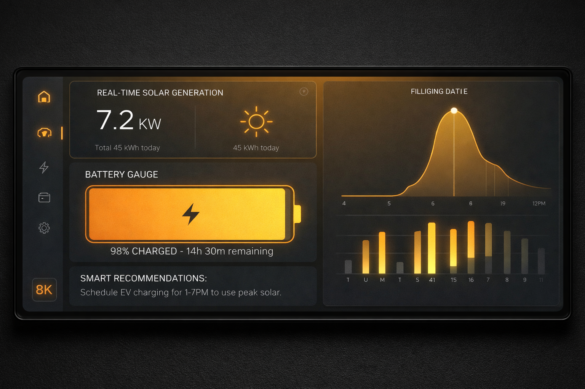
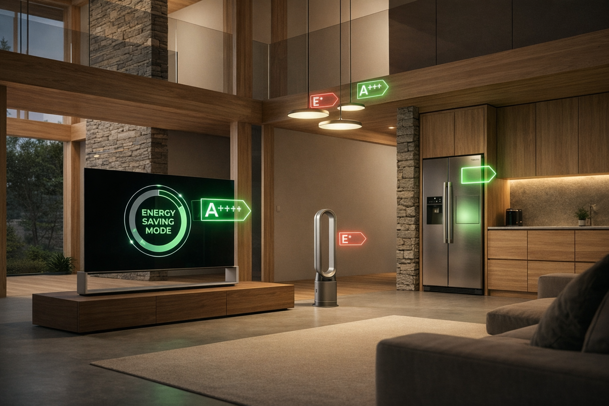
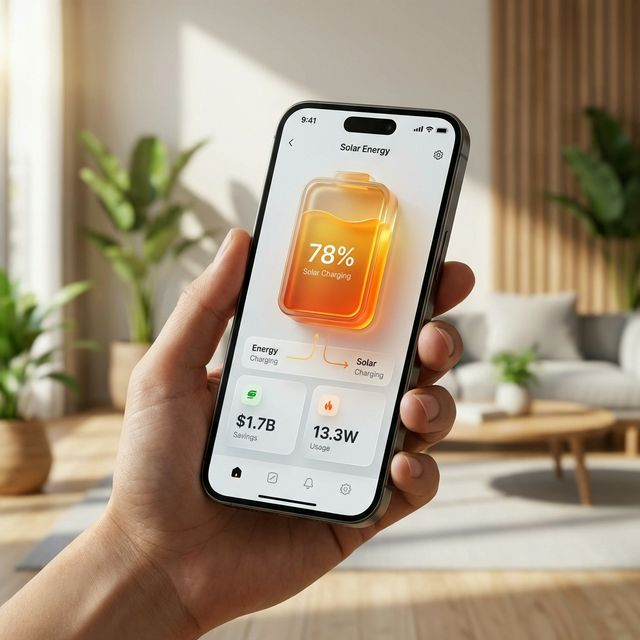

# Cahier des Charges - Projet SolarGuard

## 1. Presentation du Projet

SolarGuard est une solution logicielle innovante concue pour optimiser la gestion de la consommation electrique au sein des foyers et des petites entreprises dependants d'installations solaires autonomes (off-grid). Dans un contexte ou la stabilite energetique est un defiant majeur, notamment en Afrique de l'Ouest, SolarGuard apporte une couche d'intelligence permettant de transformer une installation solaire passive en un systeme de gestion active. L'objectif principal est de prevenir les coupures d'electricite imprevues et de prolonger la duree de vie des composants (batteries) via une aide a la decision basee sur des algorithmes predictifs et une analyse de charge en temps reel.

## 2. Objectifs Globaux

* **Evaluation en temps reel** : Calculer et afficher l'autonomie restante en heures et minutes en fonction de la charge actuelle.
* **Optimisation de la consommation** : Fournir des recommandations d'usage precises pour eviter les surcharges et les decharges profondes.
* **Sensibilisation energetique** : Eduquer l'utilisateur sur l'impact de chaque appareil sur sa reserve d'energie.
* **Pilotage visuel** : Offrir un tableau de bord analytique centralisant les donnees critiques de l'installation.
* **Preservation du materiel** : Mettre en place des alertes de securite pour proteger l'integrite physique de la batterie.

## 3. Fonctionnalites Detaillees

### 3.1. Gestion Technique du Systeme

* Parametrage exhaustif de l'installation : Tension nominale (12V/24V/48V), capacite de stockage (Ah), puissance de crete des panneaux (Wc) et puissance maximale de l'onduleur (W).
* Mise a jour dynamique du niveau de charge via une interface de saisie rapide (Input Niveau).

### 3.2. Inventaire et Modelisation de la Charge

* Creation d'un catalogue d'appareils personnalise avec puissance unitaire (Watts).
* Classification par niveau de priorite : Appareils essentiels (eclairage, communication) vs Appareils de confort (climatisation, divertissement).
* Interface CRUD (Creer, Lire, Modifier, Supprimer) pour une gestion flexible du parc electrique.

### 3.3. Algorithme de Prediction et Conseil

* Classification dynamique en quatre etats de vigilance : Optimal, Normal, Vigilance et Critique.
* Recommandations contextuelles : Liste automatique des appareils qu'il est conseille d'allumer ou d'eteindre selon le niveau de Wh disponibles.
* Calcul adaptatif : Ajustement de l'autonomie prevue en fonction de la consommation moyenne reelle.

### 3.4. Visualisation Analytique (Dashboard)

* Indicateur radial de charge instantanee avec code couleur dynamique.
* Graphique lineaire d'historique permettant de visualiser les cycles de charge et de decharge sur 24 heures.
* Graphique de repartition de la consommation pour identifier les postes energetiques les plus gourmands.

## 4. Perspectives et Evolutions Futures

Le projet SolarGuard est concu pour evoluer vers un ecosysteme complet de "Smart Energy" :

* **Integration IoT (Internet des Objets)** : Automatisation de la lecture des donnees via des capteurs (ESP32/Arduino) connectes directement aux regulateurs de charge et onduleurs.
* **Prediction Meteorologique** : Integration d'API meteo pour prevoir la production solaire des jours a venir et ajuster les conseils de consommation par anticipation.
* **Application Mobile Native** : Developpement d'une version mobile (iOS/Android) avec notifications push en cas de seuil critique atteint.
* **Intelligence Artificielle** : Utilisation du Machine Learning pour apprendre les habitudes de consommation de l'utilisateur et optimiser automatiquement les cycles de charge.
* **Mode Communaute** : Possibilite de gerer plusieurs installations pour des operateurs de micro-reseaux solaires.

## 5. Specifications Techniques et Securite

* Backend : Framework Django (Python 3.10+).
* Frontend : HTML5, CSS3 progressif (Keyframe animations), JavaScript ES6.
* Visualisation : Integration de la bibliotheque ApexCharts.js.
* Securite : Authentification robuste par email, protection contre les failles OWASP (XSS, CSRF, SQL Injection).

## 6. Public Cible

* Particuliers en zone hors-reseau (Off-grid).
* PME et cliniques utilisant le solaire comme source principale ou de secours.
* Installateurs de kits solaires souhaitant proposer un service de suivi numerique.

---

## 7. Phases de Developpement

Le developpement du projet SolarGuard a ete orchestre en plusieurs phases cles pour garantir une progression logique et une stabilite logicielle maximale.

### Phase 1 : Initialisation et Configuration de l'environnement

* Mise en place du repertoire de travail et installation du systeme de controle de version Git.
* Configuration de l'environnement virtuel Python (venv) et gestion des dependances (pip).
* Architecture initiale du projet Django et configuration de l'arborescence des fichiers statiques et des templates.

### Phase 2 : Developpement de la Logique Metier et Base de donnees

* Modelisation des tables SQL (User, Installation, Appliance, BatteryReading).
* Conception de l'algorithme "Smart Energy" : calcul des Wh disponibles, estimation d'autonomie et classification des appareils.
* Application des migrations de base de donnees et creation de l'interface d'administration.

### Phase 3 : Conception de l'Interface et UX

* Creation du Design System : choix des palettes de couleurs (Amber-Slate), typographie Inter et principes de layout.
* Developpement des templates de base et integration des polices et icônes (Phosphor Icons).
* Mise en place de la Landing Page responsive avec sections dynamiques et carrousels.

### Phase 4 : Dataviz et Experience Utilisateur Avancee

* Integration de la bibliotheque ApexCharts pour le rendu dynamique des donnees de batterie.
* Implementation d'animations CSS avancees : fondu staggered des cartes, pattern de fond anime en continu (Y-axis scroll).
* Optimisation de la navigation et des flux d'authentification (suppression du username au profit de l'email).

### Phase 5 : Stabilite, Tests et Documentation

* Redaction et execution d'un plan de tests unitaires pour valider les calculs de l'onduleur et de l'autonomie.
* Resolution des bugs de rendu et optimisation de la performance des scripts.
* Finalisation de la documentation technique et redaction du README complet.

---

## SolarGuard – Optimiseur d'Énergie Solaire Intelligent

[](https://www.python.org/)
[](https://www.djangoproject.com/)
[](https://opensource.org/licenses/MIT)

**SolarGuard** est une solution web premium conçue pour maximiser l'autonomie des installations solaires résidentielles. Grâce à des algorithmes de prédiction intelligents et une interface visuelle de pointe, gérez votre énergie comme un expert.



---

## ✨ Points Forts

### 🚀 Design Premium & Expérience Utilisateur

* **Landing Page Immersive** : Navigation fluide, carrousels dynamiques et animations d'entrée élégantes.

* **Interface Réactive** : Entièrement optimisée pour mobile, tablette et desktop.
* **Animations Subtiles** : Fond dot-pattern animé en continu et transitions de cartes fluides pour une sensation de modernité.

### 📊 Tableau de Bord Analytique (ApexCharts)

* **Visualisation Temps Réel** : Jauge radiale animée pour le niveau de batterie actuel.

* **Historique Prédictif** : Graphique d'aire illustrant l'évolution de votre charge sur les dernières 24h.
* **Distribution Énergétique** : Analyse de la répartition de consommation par appareil via un graphique donut.

### 🧠 Algorithme de Conseil Intelligent

* **Priorisation Automatique** : Classification des appareils en "Recommandé", "Acceptable" ou "À éviter" selon l'état de la batterie.

* **Calcul d'Autonomie** : Estimation précise du temps restant basée sur votre consommation actuelle.
* **Modes de Vigilance** : Seuils critiques (20%) et optimaux (80%) pour préserver la santé de vos batteries.

---

## 🛠️ Stack Technique

* **Backend** : Django (Python) pour la robustesse et la sécurité.
* **Frontend** : CSS3 moderne (Variables, Keyframes, Flexbox/Grid) & JavaScript Vanilla.
* **Visualisation** : ApexCharts.js pour des graphiques animés haute performance.
* **Iconographie** : Phosphor Icons pour un look épuré.
* **Authentification** : Système sécurisé basé sur l'email, conforme aux standards modernes.

---

## 📸 Captures d'Écran

| Gestion des Appareils | Monitoring Intelligent |
| :---: | :---: |
|  |  |

---

## 🚀 Installation & Lancement

### 1. Clonage & Environnement

```bash
git clone https://github.com/mamy83/projet-groupe8.git
cd projet-groupe8
python -m venv .venv
.\.venv\Scripts\activate  # Windows
```

### 2. Dépendances & Base de données

```bash
pip install -r requirements.txt
python manage.py migrate
```

### 3. Exécution

```bash
python manage.py runserver
```

---

## 📖 Utilisation

1. **Configuration Initiale** : Dans la page "Configuration", renseignez la capacité de vos batteries (Ah) et la puissance de vos panneaux (Wc).
2. **Inventaire** : Ajoutez vos appareils (TV, Frigo, Lampe...) avec leur puissance moyenne.
3. **Suivi** : Mettez à jour votre niveau de batterie via "Input Niveau" pour recevoir vos conseils immédiats.

---

## 🤝 Contribution

Réalisé par l'équipe **SolarGuard (Groupe 8)**.
N'hésitez pas à ouvrir une *Issue* ou à soumettre une *Pull Request* !

*Optimisé pour un avenir plus vert.* 🌱
