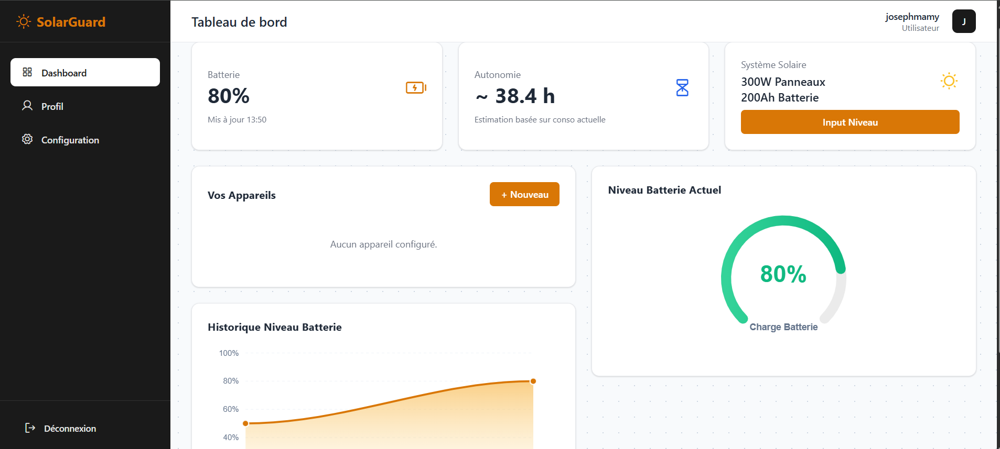
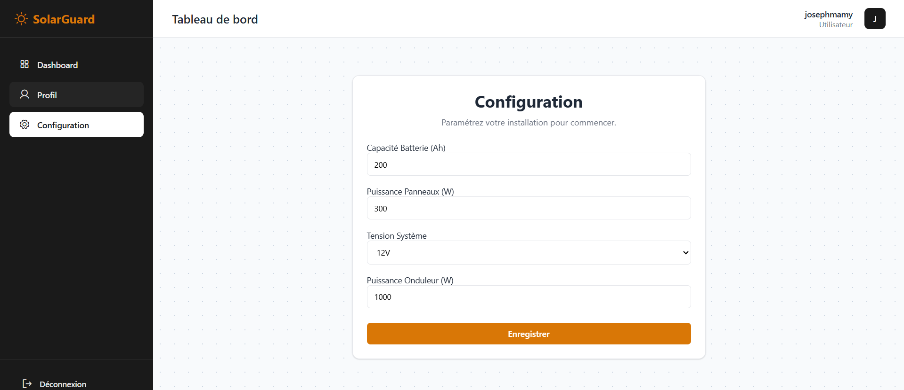

# Cahier des charges - Projet SolarGuard

## 1. Présentation du Projet

SolarGuard est une solution logicielle innovante conçue pour optimiser la gestion de la consommation électrique au sein des foyers et des petites entreprises dépendants d'installations solaires autonomes (off-grid). Dans un contexte où la stabilité énergétique est un défi majeur, notamment en Afrique de l'Ouest, SolarGuard apporte une couche d'intelligence permettant de transformer une installation solaire passive en un système de gestion active. L'objectif principal est de prévenir les coupures d'électricité imprévues et de prolonger la durée de vie des composants (batteries) via une aide à la décision basée sur des algorithmes prédictifs et une analyse de charge en temps réel.

## 2. Objectifs Globaux

* **Évaluation en temps réel** : Calculer et afficher l'autonomie restante en heures et minutes en fonction de la charge actuelle.
* **Optimisation de la consommation** : Fournir des recommandations d'usage précises pour éviter les surcharges et les décharges profondes.
* **Sensibilisation énergétique** : Éduquer l'utilisateur sur l'impact de chaque appareil sur sa réserve d'énergie.
* **Pilotage visuel** : Offrir un tableau de bord analytique centralisant les données critiques de l'installation.
* **Préservation du matériel** : Mettre en place des alertes de sécurité pour protéger l'intégrité physique de la batterie.

## 3. Fonctionnalités Détaillées

### 3.1. Gestion Technique du Système

* Paramétrage exhaustif de l'installation : Tension nominale (12V/24V/48V), capacité de stockage (Ah), puissance de crête des panneaux (Wc) et puissance maximale de l'onduleur (W).
* Mise à jour dynamique du niveau de charge via une interface de saisie rapide (Input Niveau).

### 3.2. Inventaire et Modélisation de la Charge

* Création d'un catalogue d'appareils personnalisé avec puissance unitaire (Watts).
* Classification par niveau de priorité : Appareils essentiels (éclairage, communication) vs Appareils de confort (climatisation, divertissement).
* Interface CRUD (Créer, Lire, Modifier, Supprimer) pour une gestion flexible du parc électrique.

### 3.3. Algorithme de Prédiction et Conseil

* Classification dynamique en quatre états de vigilance : Optimal, Normal, Vigilance et Critique.
* Recommandations contextuelles : Liste automatique des appareils qu'il est conseillé d'allumer ou d'éteindre selon le niveau de Wh disponibles.
* Calcul adaptatif : Ajustement de l'autonomie prévue en fonction de la consommation moyenne réelle.

### 3.4. Visualisation Analytique (Dashboard)

* Indicateur radial de charge instantanée avec code couleur dynamique.
* Graphique linéaire d'historique permettant de visualiser les cycles de charge et de décharge sur 24 heures.
* Graphique de répartition de la consommation pour identifier les postes énergétiques les plus gourmands.

## 4. Perspectives et Évolutions Futures

Le projet SolarGuard est conçu pour évoluer vers un écosystème complet de "Smart Energy" :

* **Intégration IoT (Internet des Objets)** : Automatisation de la lecture des données via des capteurs (ESP32/Arduino) connectés directement aux régulateurs de charge et onduleurs.
* **Prédiction Météorologique** : Intégration d'API météo pour prévoir la production solaire des jours à venir et ajuster les conseils de consommation par anticipation.
* **Application Mobile Native** : Développement d'une version mobile (iOS/Android) avec notifications push en cas de seuil critique atteint.
* **Intelligence Artificielle** : Utilisation du Machine Learning pour apprendre les habitudes de consommation de l'utilisateur et optimiser automatiquement les cycles de charge.
* **Mode Communauté** : Possibilité de gérer plusieurs installations pour des opérateurs de micro-réseaux solaires.

## 5. Spécifications Techniques et Sécurité

* Backend : Framework Django (Python 3.10+).
* Frontend : HTML5, CSS3 progressif (Keyframe animations), JavaScript ES6.
* Visualisation : Intégration de la bibliothèque ApexCharts.js.
* Sécurité : Authentification robuste par email, protection contre les failles OWASP (XSS, CSRF, SQL Injection).

## 6. Public Cible

* Particuliers en zone hors-réseau (Off-grid).
* PME et cliniques utilisant le solaire comme source principale ou de secours.
* Installateurs de kits solaires souhaitant proposer un service de suivi numérique.

---

## 7. Phases de Développement

Le développement du projet SolarGuard a été orchestré en plusieurs phases clés pour garantir une progression logique et une stabilité logicielle maximale.

### Phase 1 : Initialisation et Configuration de l'environnement

* Mise en place du répertoire de travail et installation du système de contrôle de version Git.
* Configuration de l'environnement virtuel Python (venv) et gestion des dépendances (pip).
* Architecture initiale du projet Django et configuration de l'arborescence des fichiers statiques et des templates.

### Phase 2 : Développement de la Logique Métier et Base de données

* Modélisation des tables SQL (User, Installation, Appliance, BatteryReading).
* Conception de l'algorithme "Smart Energy" : calcul des Wh disponibles, estimation d'autonomie et classification des appareils.
* Application des migrations de base de données et création de l'interface d'administration.

### Phase 3 : Conception de l'Interface et UX

* Création du Design System : choix des palettes de couleurs (Amber-Slate), typographie Inter et principes de layout.
* Développement des templates de base et intégration des polices et icônes (Phosphor Icons).
* Mise en place de la Landing Page responsive avec sections dynamiques et carrousels.

### Phase 4 : Dataviz et Expérience Utilisateur Avancée

* Intégration de la bibliothèque ApexCharts pour le rendu dynamique des données de batterie.
* Implémentation d'animations CSS avancées : fondu staggered des cartes, pattern de fond animé en continu (Y-axis scroll).
* Optimisation de la navigation et des flux d'authentification (suppression du username au profit de l'email).

### Phase 5 : Stabilité, Tests et Documentation

* Rédaction et exécution d'un plan de tests unitaires pour valider les calculs de l'onduleur et de l'autonomie.
* Résolution des bugs de rendu et optimisation de la performance des scripts.
* Finalisation de la documentation technique et rédaction du README complet.

---

## 📸 Captures d'Écran

| Tableaux de bord 
| |

---
| Configuration Système 
|  |

---

## 🚀 Installation & Lancement

### 1. Clonage & Environnement

```bash
git clone https://github.com/mamy83/projet-groupe8.git
cd projet-groupe8
python -m venv .venv
.\.venv\Scripts\activate  # Windows
```

### 2. Dépendances & Base de données

```bash
pip install -r requirements.txt
python manage.py migrate
```

### 3. Exécution

```bash
python manage.py runserver
```

---

## 📖 Utilisation

1. **Configuration Initiale** : Dans la page "Configuration", renseignez la capacité de vos batteries (Ah) et la puissance de vos panneaux (Wc).
2. **Inventaire** : Ajoutez vos appareils (TV, Frigo, Lampe...) avec leur puissance moyenne.
3. **Suivi** : Mettez à jour votre niveau de batterie via "Input Niveau" pour recevoir vos conseils immédiats.

---

## 🤝 Contribution

Réalisé par l'équipe **SolarGuard (Groupe 8)**.
N'hésitez pas à ouvrir une *Issue* ou à soumettre une *Pull Request* !

*Optimisé pour un avenir plus vert.* 🌱
